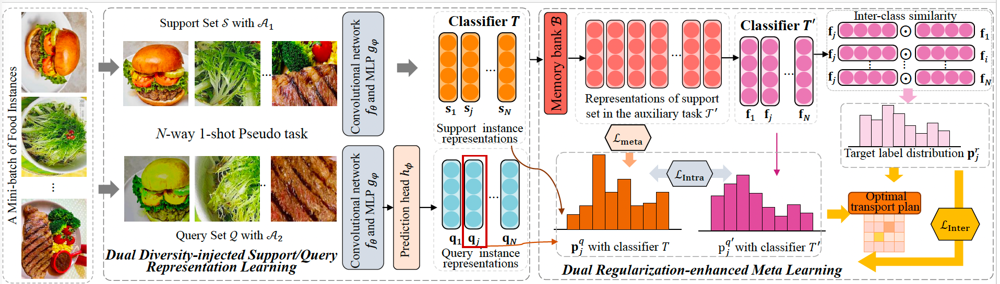

<div align="center">

# Unsupervised Few-shot Food Recognition with Intra-Class Variationand Inter-Class Similarity Modeling (UFFR-IVIS)

**Na Zheng**<sup>1</sup> &nbsp; **Xuemeng Song**<sup>2</sup>✉ &nbsp; **Wai Teng Tang**<sup>3</sup> &nbsp; **See-Kiong Ng**<sup>1</sup> &nbsp; **Liqiang Nie**<sup>4</sup> &nbsp; **Roger Zimmermann**<sup>1</sup>

<sup>1</sup>School of Computing, National University of Singapore
<sup>2</sup>Department of Data Science, Department of Data Science, Southern University of Science and Technology 
<sup>3</sup>GrabTaxi Holdings Pte., Ltd.
<sup>4</sup>Harbin Institute of Technology (Shenzhen)

✉ Corresponding author  
</div>

## 📌 Introduction

This repository contains the official implementation of the paper **Unsupervised Few-shot Food Recognition with Intra-Class Variationand Inter-Class Similarity Modeling**. It focuses on the **Unsupervised Few-shot Learning for Food Recoginition** task: it leverages large-scale unlabeled food data during training to capture intra-class variation and inter-class similarity, and adapts to novel classes at test time using only a few labeled examples.


## 🏗️ Architecture

<p align="center">
  
  <figcaption><strong>Figure 1.</strong> Overall framework of `UFFR-IVIS`. It consists of  (1) dual diversity-injected support/query representation learning that introduces instance-level and representation-level diversities for the representation learning of support/query instance to model the characteristics of high intra-class variation; and  (2) dual regularization-enhanced meta learning that designs two regularizations: auxiliary task-based intra-class regularization and similarity-guided inter-class regularization to regularize the intra-class variation and inter-class similarity modeling, respectively.</figcaption>
</p>


---

## Project Structure

```text
.
├── assets/                
├── data/                  
├── model/
├── eval.py
├── test.py
├── train.py
├── utils.py                  
├── README.md
├── requirements.txt
└── LICENSE
```

## Installation

### 1. Clone the repository

```bash
git clone https://github.com/iLearn-Lab/TCSVT25-UFFR-IVIS.git
cd TCSVT25-UFFR-IVIS
```

### 2. Create environment

We recommend using Conda to manage your environment:
```bash
conda create -n encoder_env python=3.9
conda activate encoder_env

# Install PyTorch (Ensure it matches your CUDA version)
pip install torch torchvision torchaudio --index-url [https://download.pytorch.org/whl/cu118](https://download.pytorch.org/whl/cu118)
```
### 3. Install dependencies

```bash
pip install -r requirements.txt
```

## Dataset

For evaluation on the newly proposed task of **unsupervised few-shot food recognition**, we construct two datasets: **MiniFood** and **LargeFood** with different scales. Both datasets are derived from the publicly available **Food2K** dataset, which contains 2,000 fine-grained food categories.  

You can download the processed datasets here:  
[MiniFood & LargeFood (Google Drive)](https://drive.google.com/drive/folders/1Bz7cygevBJd9_gEKhTbejQqW45m9FEIH?usp=drive_link)  

For access to the original **Food2K** dataset, please follow the official instructions:  
[Food2K Official Website](http://123.57.42.89/FoodProject.html)
After downloading the dataset, ensure that the folder structure matches the following:

### MiniFood and LargeFood

Dataset_Root/
├── class_lists.json
├── train_label.json
├── dis_train.json
├── dis_train_label.json
├── MiniTest1.json
├── MiniTest1_label.json
├── MiniTest2.json
├── MiniTest2_label.json
└── [images | data_folders] /
    ├── [class_name_01 | class_name_02 | ...]
    │   └── [image_001.jpg | label_001.txt | ...]
    └── ...


## Training scripts

python train.py --eval_all --unsupervised --batch_size 64 --augment 'ws' - --max_epoch 300 --model_class ProtoNet --backbone_class ConvNet --dataset Food2K --way 5 --shot 1 --query 5 --eval_query 15 --lr 0.002 --lr_scheduler cosine  --gpu 0 --eval_interval 2 --similarity cosine 
## Test scripts
python eval.py --path checkpoint.pth \
  --eval_all --model_class ProtoNet --backbone_class ConvNet --num_test_episodes 1000 \
  --gpu 0 --eval_dataset Food2K --augment test --similarity cosine
## Acknowledgment
We thank the following repos providing helpful components/functions in our work.
- [ProtoNet](https://github.com/cyvius96/prototypical-network-pytorch)
- [TSP-Head])(https://github.com/hanlu-nju/revisiting-UML/)
